# **升学e网通刷网课可行性猜想与实践**
## 第一步：确定设备
请使用**具有扩展功能的**浏览器访问`https://www.ewt360.com`
> [!TIP] **本方案适用于`电脑`和`手机`！！！！！！！！！！！！**

> [!IMPORTANT] 推荐使用**电脑**进行观看，手机请使用`狐猴浏览器、edge浏览器`进行观看 电脑用户**请勿使用**`Internet Explorer`和`Safari浏览器` 手机用户**请勿使用**`未具有拓展功能的国产浏览器`及`Safari浏览器`

## 第二步：安装插件
### 1.打开插件市场
> [!TIP] 本教程以**Microsoft Windows11 26H1**安装的**Edge浏览器**为例，其他情况请自主判断

访问`https://microsoftedge.microsoft.com/addons/Microsoft-Edge-Extensions-Home`进入`Microsoft Edge Add-ons`
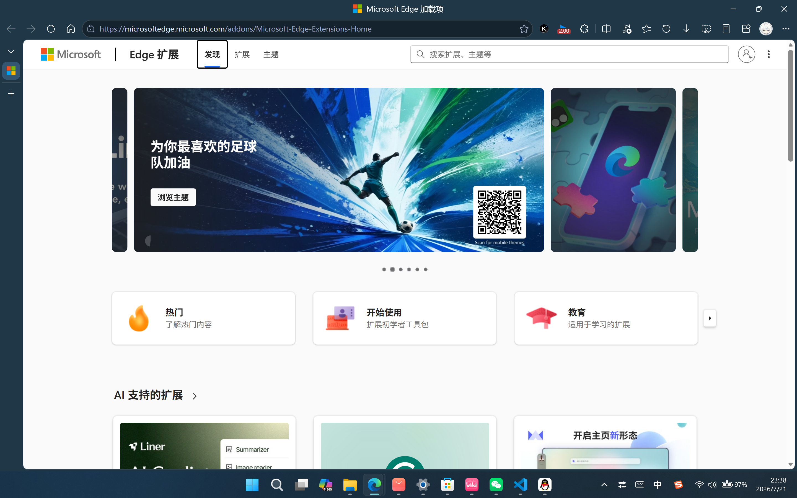
### 2.搜索插件
在右上角的搜索栏中键入`Global Speed`并回车，随后会出现相关结果（通常为第一个）
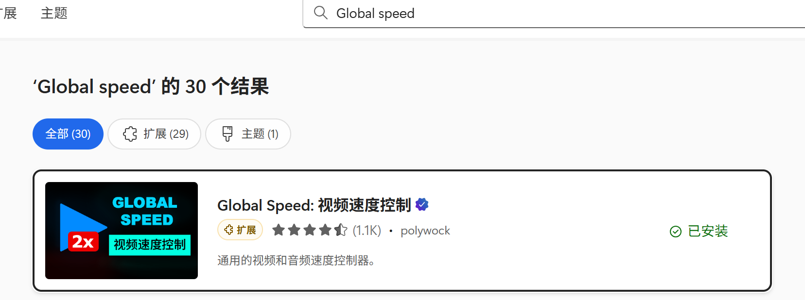
### 3.下载插件
点击结果会跳转到详情页，请点击右上角的`获取`按钮进行安装，**若浏览器弹出询问弹窗，请一律点`允许`**
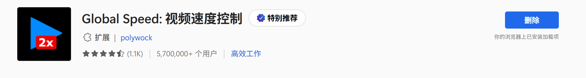

## 第三步：开始刷课
**1. 访问`https://www.ewt360.com`**
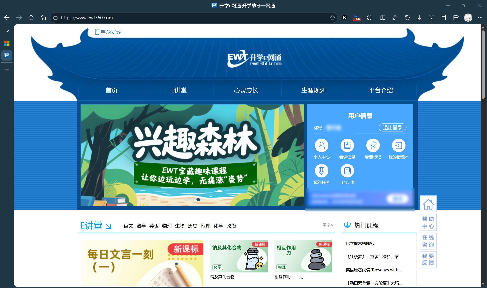

**2. 点击`我的任务`，进入任务列表**
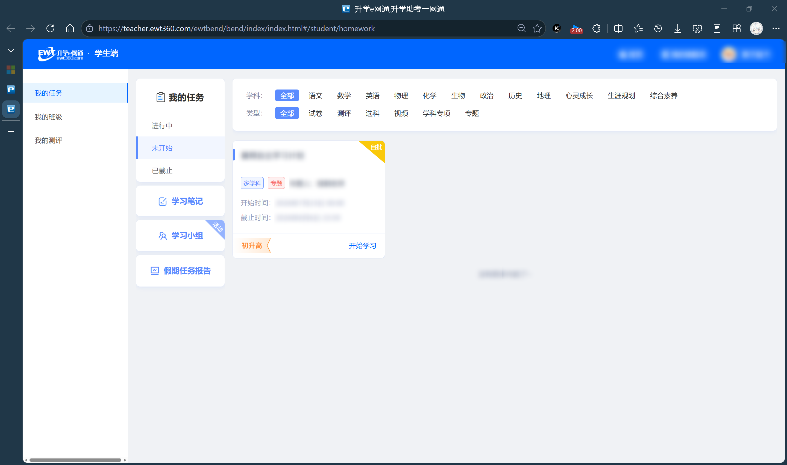

**3. 选择你要刷的任务，进入课程选择页**
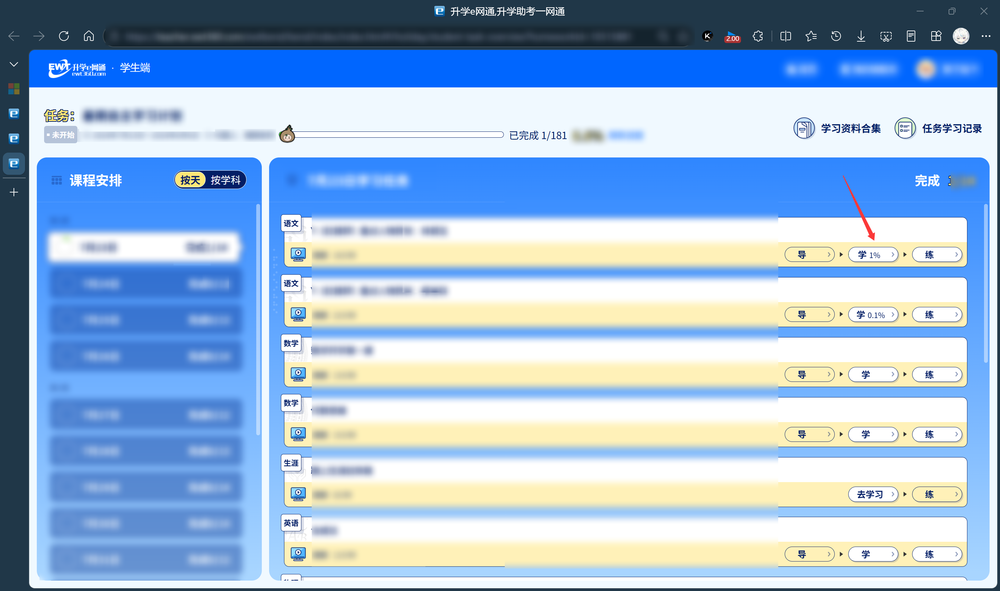

**4. 点击`学`进入视频播放页**
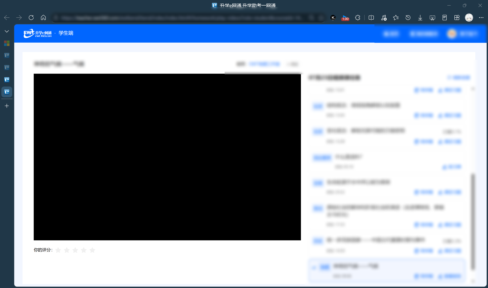

**5. 点击右上角 *三个点* 展开二级菜单**（本步骤可以省去，直接跳转至**步骤7**）
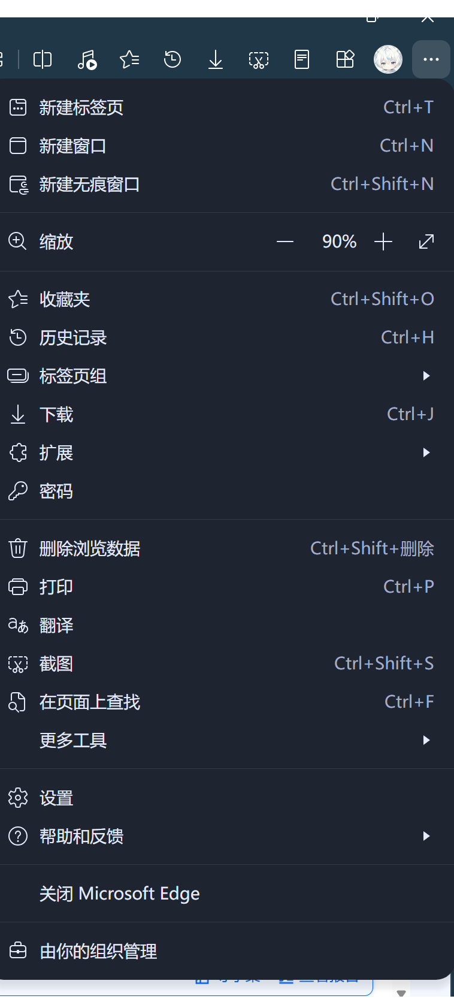

**6. 点击`扩展`，展开菜单**（本步骤可以省去，直接跳转至**步骤7**）
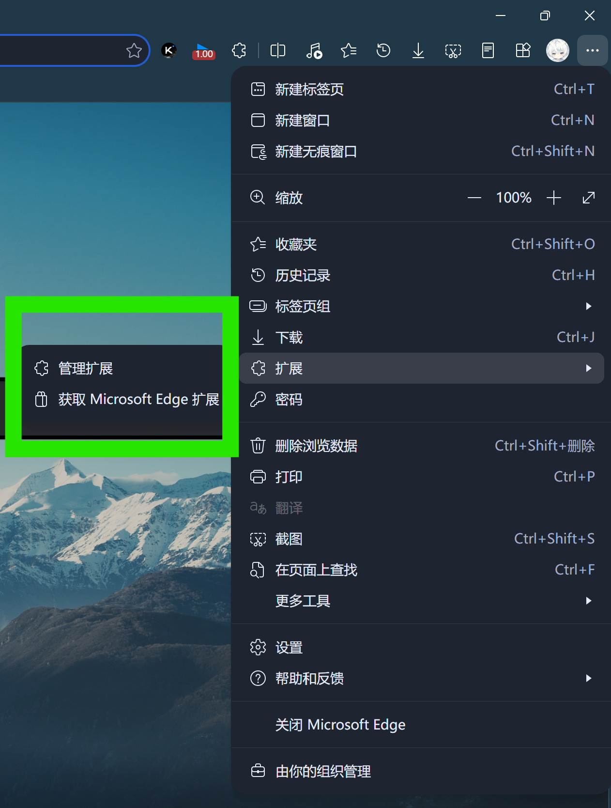

**7. 点击`管理扩展`，打开管理，确认本插件为打开状态后回到视频播放页**（本步骤可以省去，直接跳转至**步骤7**）
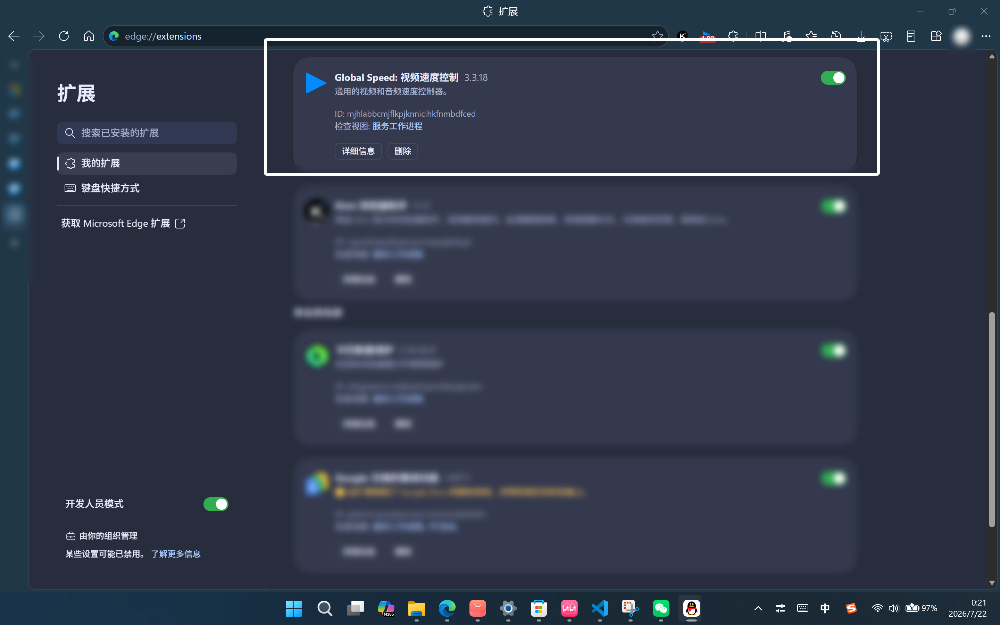

**8. 点击右上角`拼图图标`，进入扩展列表**
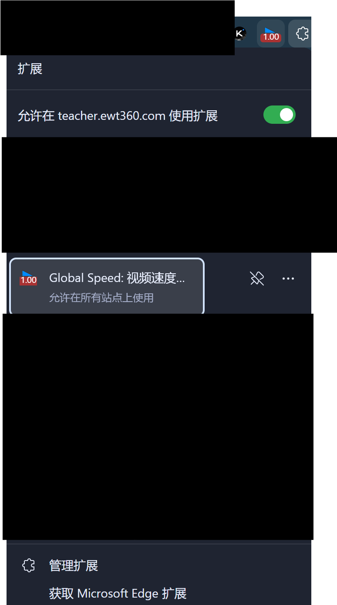

**9. 点击`Global Speed`，弹出设置浮窗，选择你希望的倍数**
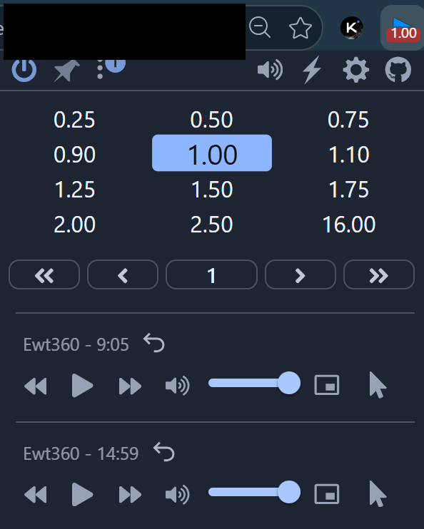
> [!IMPORTANT] 请不要选择``大于2x的``速率，否则会**禁止上课**
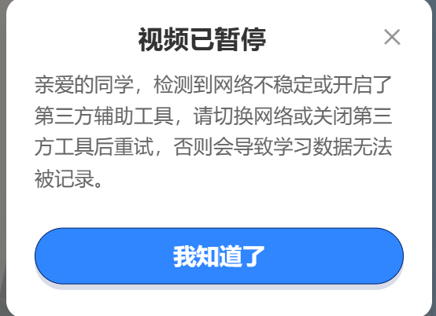

>[!WARNING] **免责声明** 1. **内容性质说明** 本文《升学e网通刷网课可行性猜想》仅为**技术原理探讨与理论猜想**，全部内容仅供学习交流、技术研究使用，不构成任何实际操作建议，亦无教唆、诱导他人实施违规操作的意图。 2. **平台规则与合规风险** 升学e网通（`https://www.ewt360.com`）的课程服务受平台《用户服务协议》、运营规则及《中华人民共和国著作权法》等相关法律法规约束。使用第三方插件加速播放、违规刷课等行为可能违反平台规则，存在账号封禁、学习记录作废、服务权限终止等风险，所有风险与法律后果均由实际操作者自行承担。 3. **第三方工具免责** 文中提及的浏览器、`Global Speed` 插件及相关第三方工具仅为技术示例，本文不对其安全性、稳定性、合规性及使用效果作出任何明示或默示的担保。因安装、使用上述第三方工具导致的设备故障、数据丢失、隐私泄露、账号异常等任何问题，本文作者不承担任何法律责任与赔偿责任。 4. **知识产权提示** 平台内所有课程、图文、音频等内容均受知识产权保护，任何人不得通过违规手段批量获取、传播或用于非学习用途。因违规使用内容引发的侵权责任，由行为人自行全部承担。 5. **责任界定** 任何基于本文内容实施的实际操作，均视为操作者自主判断、自主决策的行为。由此产生的一切直接、间接损失或法律后果，均由操作者自行承担，本文作者不承担任何责任。 6. **规则更新提示** 若平台运营规则、相关法律法规发生更新或调整，以官方最新规则及现行有效法律规定为准。
